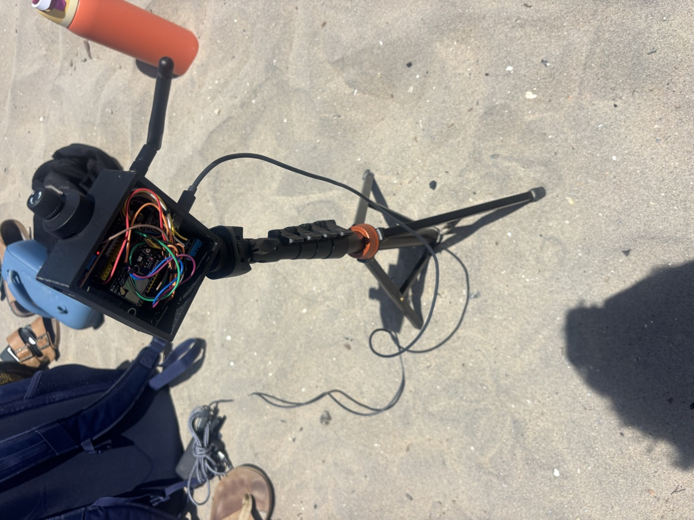
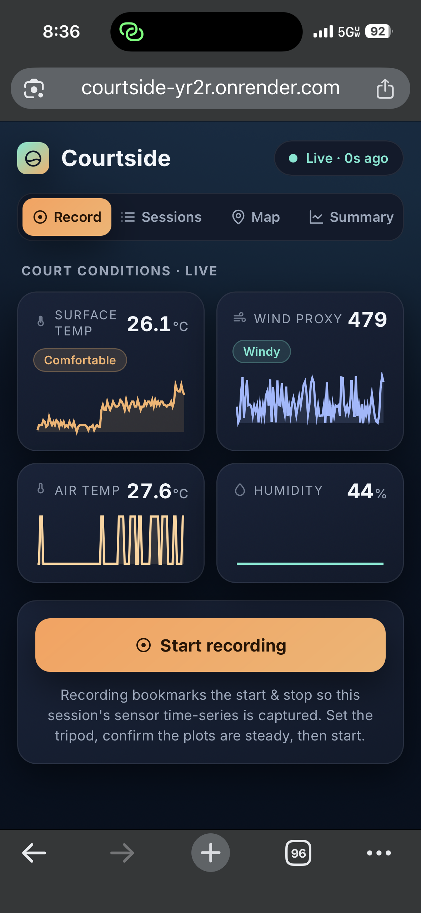
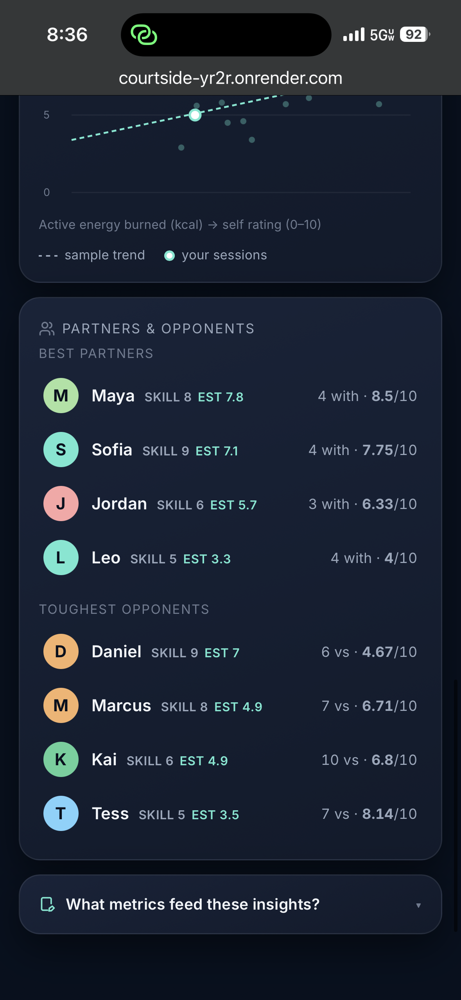
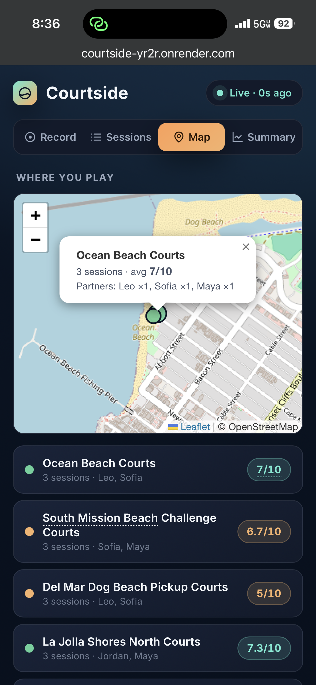
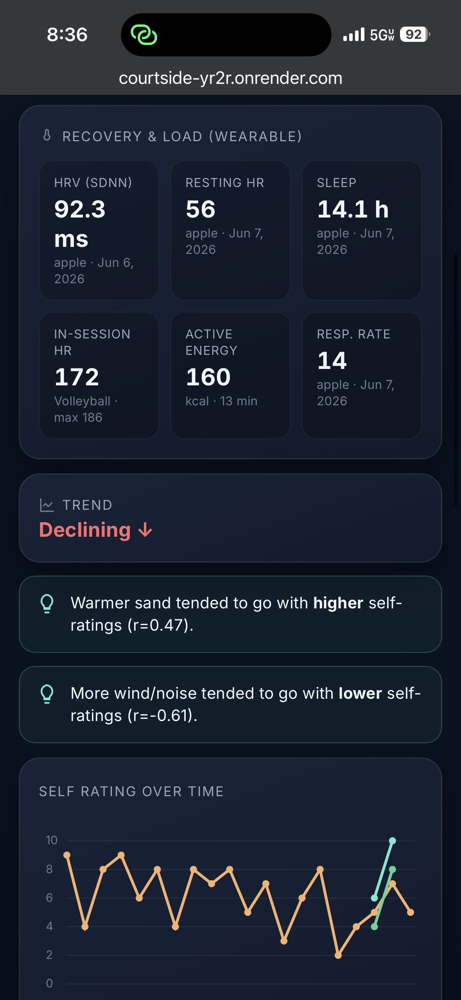
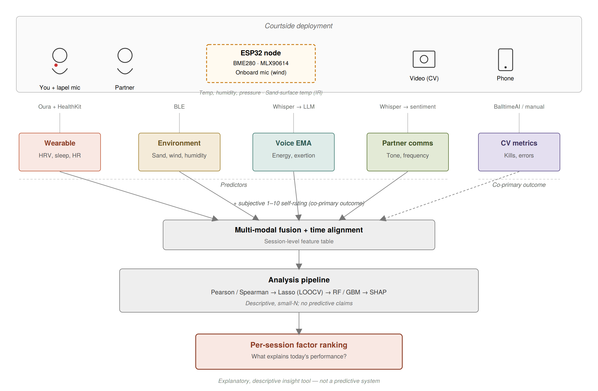
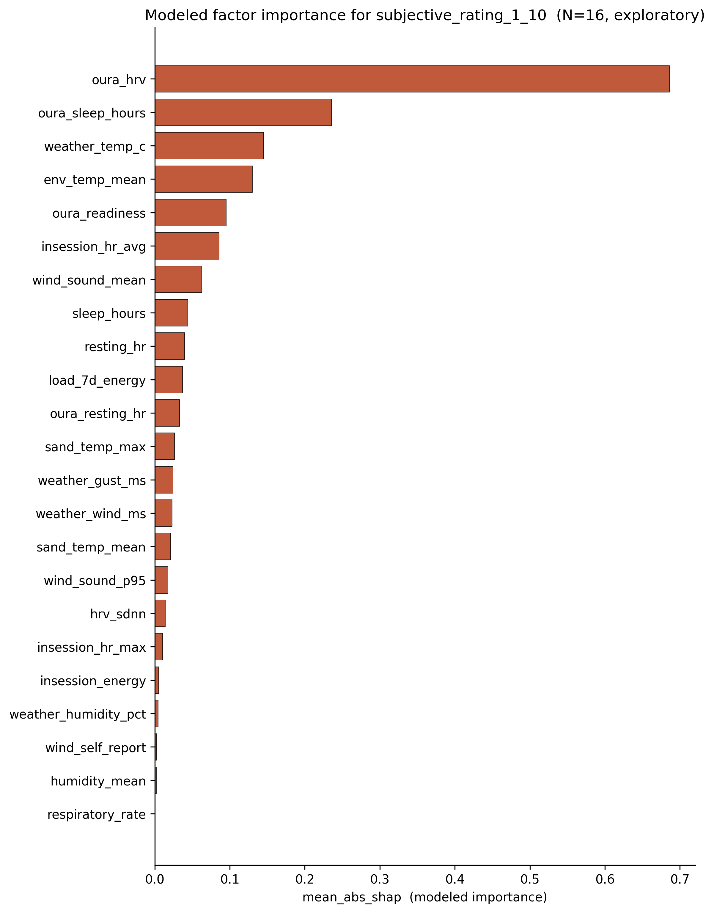

# Courtside — Multi-Modal Beach Volleyball Performance Sensing

> An end-to-end personal-analytics instrument that fuses a custom ESP32 courtside
> sensor node, wearable recovery data, and per-session self-report to explain
> day-to-day beach volleyball performance for a single athlete.

**Live demo → https://courtside-yr2r.onrender.com**
*(free tier — the first load cold-starts in ~30–60s; the people/relationships shown are synthetic demo data.)*

Built solo for **ECE 284 — Hardware Sensing for Digital Health**, UC San Diego.



## What it does

Three independent streams are captured courtside and time-aligned into one
per-session feature table:

- **Courtside node (hardware).** An ESP32-S3 logs air temperature + humidity
  (DHT11), sand-surface temperature (MLX90614 IR), and an acoustic wind proxy
  (electret mic). It posts readings over the athlete's iPhone hotspot to the
  cloud — no laptop needed on the sand.
- **Web app (FastAPI + Postgres).** A live phone dashboard for positioning the
  node, automatic ingestion of Apple Watch recovery metrics (HRV, resting HR,
  sleep) via Health Auto Export, a one-tap session log, and per-person /
  per-court / partner-vs-opponent relationship views.
- **Analysis (ML).** Per-session features → correlation screen → Lasso with
  leave-one-out CV → random forest / gradient boosting → SHAP, producing an
  interpretable ranking of which factors most explain performance.

## Screenshots

| Record a session | People & relationships |
|---|---|
|  |  |
| **Court map** | **Recovery** |
|  |  |

## Architecture



## Factor ranking — the deliverable

The four-stage pipeline outputs an interpretable ranking of the environmental and
physiological factors that best explain session-to-session performance.



## Repo layout

```
firmware/   ESP32-S3 PlatformIO project (DHT11 + MLX90614 + mic, WiFi POST)
backend/    FastAPI app + mobile dashboard (one-click deploy via render.yaml)
scripts/    data pipeline: wearable parse, feature merge, 4-stage analysis
oura/       Oura API pull + validation plots
docs/       enclosure spec, HealthKit setup, run/defense guides, images
```

## Run it locally

```bash
# backend + dashboard
pip install -r backend/requirements.txt
uvicorn app.main:app --app-dir backend --reload        # http://127.0.0.1:8000

# firmware (PlatformIO)
cp firmware/include/secrets.h.example firmware/include/secrets.h   # fill in WiFi + backend URL
cd firmware && pio run -t upload && pio device monitor -b 115200

# analysis
pip install -r requirements.txt
python scripts/build_features.py && python scripts/analysis.py
```

Secrets (`.env`, `firmware/include/secrets.h`) are gitignored — copy the matching
`.example` files and fill in your own. Deploy to the cloud with the included
`render.yaml` (Render Blueprint → provisions the web service + Postgres).

## Notes & scope

- **N = 1 pilot.** Results are descriptive, not statistically powered; small-N is
  handled with LOOCV + regularization and reported honestly.
- **Demo data is synthetic** (`scripts/seed_demo.py`) — the partners, opponents,
  and relationship signals in the live demo exist to exercise the UI, not to
  describe real people.
- **Privacy.** Raw personal biometrics are kept out of this repo by design;
  regional weather (Open-Meteo) is used only as a coarse baseline against the
  node's court-level microclimate measurements.

## License

[MIT](LICENSE)
